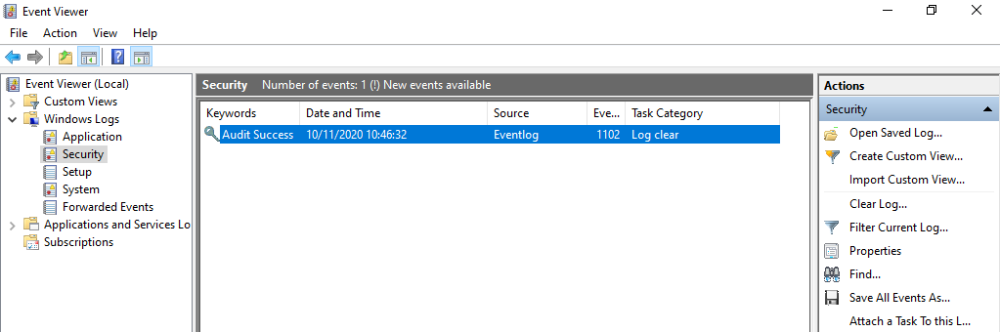
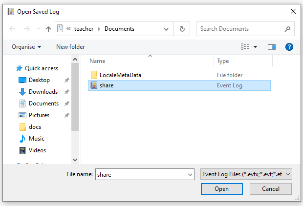
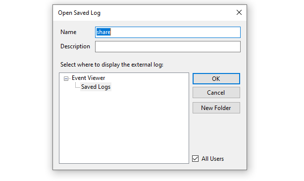

# Домашнее задание к занятию «ОС Windows (часть 2)»

В качестве результата пришлите ответы на вопросы в личном кабинете студента на сайте [netology.ru](https://netology.ru).

## Задача Audit

### Легенда

На лекции мы рассмотрели работу с EventViewer'ом и журналом событий. В это ДЗ вам необходимо будет закрепить данные навыки и проанализировать готовый журнал событий.

### Задача

Скачайте [выгрузку журнала событий](assets/events.evtx) и предоставьте ответы на следующие вопросы:
1. Для каких пользователей (логины и SID'ы) зарегистрированы события типа `Audit Failure` по доступу к файлу `Share.txt`?
1. Каковы ID событий (Event ID) и время, когда это было зафиксировано (в русскоязычной Windows `Код события`)?
1. С помощью каких процессов (приложений) была осуществлена попытка доступа (в русскоязычной Windows `Имя процесса`)?

### Выполнение

Пошаговое выполнение

##### Шаг 1. откройте EventViewer с помощью команды `eventvwr`

##### Шаг 2. Выберите опцию `Open Saved Logs` в правой панели

##### Шаг 3. Выберите файл `events.evtx` (предварительно скачайте его по ссылке [`events.evtx`](assets/events.evtx))

##### Шаг 4. Подтвердите открытие файла журнала

##### Шаг 5. Используя инструменты фильтрации, поиска и навигации найдите необходимые события

