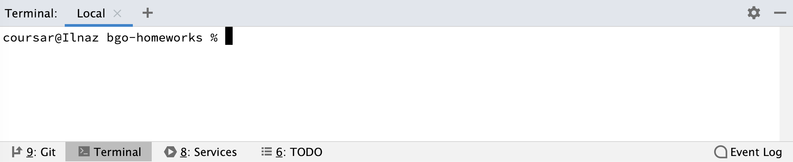

# Краткое руководство по работе с терминалом

### GoLand

Во всех IDE JetBrains (GoLand в их числе), который мы будем использовать в рамках этого курса, сочетание клавиш `Alt + F12` позволяют сразу открыть терминал в каталоге, где расположен текущий проект:

