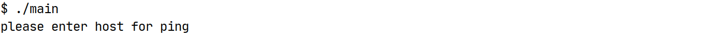

# Домашнее задание к занятию «Язык С и программные уязвимости»

**Описание задания**

В рамках данного задания вам предстоит разобраться с уязвимостями в программе на языке C. Программа содержит уязвимость, которая может привести к падению приложения или выполнению другой команды.

**Инструкция к выполнению:**
1.	Формат сдачи домашнего задания - ссылка на Google документ.
2.	Предоставьте доступ на комментирование всем, у кого есть ссылка.
3.	Выполните задание в два этапа:
Задание 1: Найдите уязвимость и попытайтесь вызвать сбой приложения (segmentation fault).
Задание 2: Проанализируйте «исправленную» программу и ответьте на вопросы, связанные с безопасностью.
4. Загрузите решения в личном кабинете студента на сайте [netology.ru](https://netology.ru).

**Практическая ценность задания**
В реальной жизни выявление и устранение подобных уязвимостей является важной частью работы специалистов по безопасности программного обеспечения. Программы с подобными ошибками могут стать мишенью для атак, поэтому их необходимо исправлять ещё на стадии разработки. В рамках этого задания вы научитесь анализировать код на наличие таких ошибок и понимать, как злоумышленники могут их использовать.


## Задание 1

**Важно**: выполняйте данную задачу на ОС Linux (Ubuntu или Kali)

### Легенда

У вас есть следующий код:
```c
#include <stdio.h>
#include <string.h>
#include <stdlib.h>

int main() {
    /* выделяем буфер из 255 символов + \0 для хранения команды */
    char command[256] = {'p', 'i', 'n', 'g', ' ', '\0'};
    /* буфер для хранения хоста, который нужно пропинговать */
    char host[16];

    printf("please enter host for ping\n");
    /* получаем от пользователя имя хоста - нужно ввести в консоли, например, ya.ru и нажать Enter */
    gets(host);

    /* отладочный вывод - печатаем команду */
    printf("command: %s\n", command);
    /* отладочный вывод - печатаем хост */
    printf("host: %s\n", host);

    /* добавляем к команде хост, при этом \0 в команде заменяется на первый символ из host */
    strcat(command, host);

    /* отладочный вывод - печатаем полную команду */
    printf("full command: %s\n", command);

    /* выполняем команду */
    system(command);

    return 0;
}
```

*Важно*: строки, которые начинаются с `/*` и заканчиваются `*/` - это комментарии (пояснения к коду программы), вы можете их не печатать.

### Задача

По аналогии с лекцией установите необходимые зависимости (`apt update && apt install gcc`) и скомпилируйте данную программу (`cc main.c -o main`) - не обращайте внимание на предупреждения, если они будут.

Далее:
1\. Запустите её (`./main`), вы увидите приглашение вида:



2\. Введите адрес хоста, который необходимо пропинговать и убедитесь, что пинг работает:


3\. Завершите работу приложения с помощью сочетания клавиш Ctrl + C

Творческая часть: попробуйте подобрать данные (по аналогии с лекцией) так, чтобы:
1. Приложение "упало" (вы получили сообщение segmentation fault или другое, свидетельствующее об ошибке)

_Пример:_
Попробуйте ввести очень длинный адрес хоста (например, 100 символов) и посмотрите, как программа себя поведёт.

Этот дополнительный пример поможет вам более глубоко понять, как различные типы ввода могут привести к проблемам с безопасностью.

**Результаты:**
В ответах укажите ввод, приводящий к падению приложения, в личном кабинете студента на сайте netology.ru.


## Задание 2

**Важно**: выполняйте данную задачу на ОС Linux (Ubuntu или Kali)

### Легенда

Программисты прислали вам якобы "исправленный" вариант программы `ping`:
```c
#include <stdio.h>
#include <string.h>
#include <stdlib.h>

int main() {
    /* выделяем буфер из 24 символов для хранения команды */
    char command[24] = "ping ";
    /* буфер для хранения хоста, который нужно пропинговать */
    char host[16];

    printf("please enter host for ping\n");
    /* получаем от пользователя имя хоста */
    /* нужно ввести в консоли, например, ya.ru и нажать Enter */
    fgets(host, sizeof(host), stdin);

    /* отладочный вывод - печатаем команду */
    printf("command: %s\n", command);
    /* отладочный вывод - печатаем хост */
    printf("host: %s\n", host);

    /* добавляем к команде хост, при этом \0 в команде заменяется на первый символ из host */
    strcat(command, host);

    /* отладочный вывод - печатаем полную команду */
    printf("full command: %s\n", command);

    /* выполняем команду */
    system(command);

    return 0;
}
```

### Задача
Проведите повторный анализ и посмотрите:
Можно ли реализовать падение приложения?
Можно ли выполнить произвольную команду (если да, то как)?
Если ответ на п.2 - да, то можно ли получить shell (т.е. запустить sh и bash и продолжить работу с интерпретатором команд в интерактивном режиме)?

_Пример:_ Попробуйте ввести специальные символы (например, ; rm -rf /), чтобы проверить, выполнит ли программа произвольные команды.

### Результаты
Заполните ответы на вопросы из задания и загрузите их в личном кабинете на сайте netology.ru.


**Критерии выполнения задания**
_Задание 1_ (анализ уязвимости и компиляция программы):
1.	Корректность компиляции программы: Студент должен успешно скомпилировать программу без критических ошибок.
2.	Запуск программы: Программа должна корректно запрашивать ввод хоста и выполнять команду ping.
3.	Творческая часть (выявление ошибки): Студент должен продемонстрировать, как программа может «упасть».
_Задание 2_ (анализ исправленного кода):
1.	Анализ исправленной программы: Студент должен корректно ответить на вопросы о том, возможно ли падение приложения и можно ли выполнить произвольную команду.
2.	Понимание уязвимости: Студент должен объяснить, какие уязвимости могут быть в исправленном коде и как их можно использовать для выполнения произвольных команд.
3.	Качество ответа на вопросы: Студент должен чётко, полно и грамотно ответить на вопросы, включая описание уязвимостей и потенциальных атак, а также методы их эксплуатации.
4.	Документация и отчет: Студент должен предоставить отчет с результатами, который включает в себя:
Ввод, который вызвал падение программы (для задания 1).
Ответы на вопросы из задания 2.
Возможные объяснения о том, как были найдены уязвимости.


